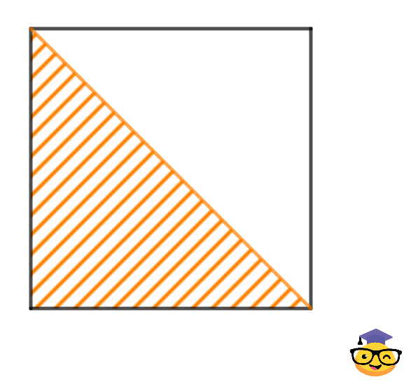

---

### Максимальный в области 1

**Описание**  
Напишите программу, которая находит и выводит максимальный элемент в заштрихованной области квадратной матрицы. Заштрихованная область включает все элементы, находящиеся на и ниже главной диагонали матрицы.



#### Формат входных данных
На вход программе подаются:
1. Натуральное число \( n \) — количество строк и столбцов в матрице.
2. Элементы матрицы (целые числа), записанные построчно через пробел.

#### Формат выходных данных
Программа должна вывести одно число — максимальный элемент в заштрихованной области квадратной матрицы.

#### Примечание
Элементы главной диагонали также учитываются в заштрихованной области.

#### Примеры

**Пример 1**

Входные данные:
```
3
1 4 5
6 7 8
1 1 6
```

Выходные данные:
```
7
```

**Пример 2**

Входные данные:
```
4
0 1 4 6
0 0 2 5
0 0 0 7
0 0 0 0
```

Выходные данные:
```
0
```

**Пример 3**

Входные данные:
```
2
6 0
7 9
```

Выходные данные:
```
9
```

**Пример 4**

Входные данные:
```
3
-50 -10 -20
-19 -78 -70
-11 -12 -19
```

Выходные данные:
```
-11
```

